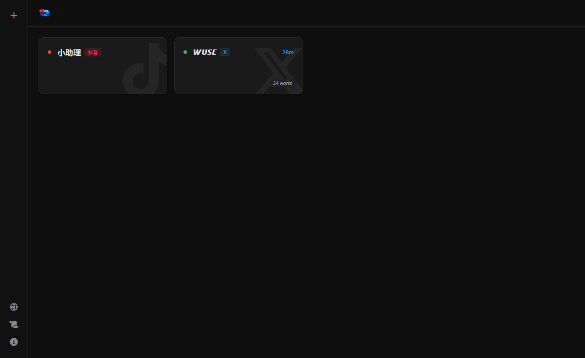
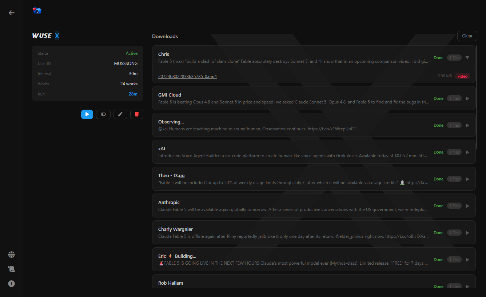

# Fav Vault - 📦 Social Media Favorites to Auto-Download Pipeline

[简体中文](README_ZH.md) | English

Favorites → Task Queue → Auto Download → Archive → Dedup → Done

Fav Vault is an automation tool that converts social media "bookmark" actions into executable download tasks, enabling automatic retrieval and local archiving of favorited content.

Your bookmarks are no longer just a static list — they become a continuously running content processing system.

<p align="center"></p>
<p align="center"></p>

---

## ⚠️ Warning

This project may trigger social media risk-control rules and carries unpredictable risks. Use with caution.  
The program will **unfavorite/unbookmark** each post after processing.  
Login credentials are stored in the local database — please keep the database file secure.  
This tool is for learning and technical exchange only. Please comply with platform rules and applicable laws.

---

## ✨ Features

### 📥 Automated Bookmark Collection
Automatically reads social media bookmarks and converts them into download tasks with no manual intervention.

### ⚙️ Task-Based Processing
Executes downloads via a task queue with scheduled runs and manual triggers.

### 🗂️ Automatic Archive Management
Organizes files by author / source for clear browsing. Customizable download path templates.

### 📊 Real-time Progress Tracking
Shows overall and per-file download progress in real-time with SSE push updates.

### 🖼️ File Preview
Click file names to open inline preview for images and videos. Supports arrow key navigation.

---

## 📸 Supported Platforms

| Platform | Status | Driver |
|----------|--------|--------|
| Douyin | ✅ Supported | Favorites |
| Twitter / X | ✅ Supported | Bookmarks |

---

## 🚀 Quick Start

### Local Run

```bash
npm install
npm start
```

Custom parameters:

```bash
CHROME_PATH=/path/to/chrome PORT=8080 npm start
```

Windows:

```powershell
$env:CHROME_PATH="C:\path\chrome.exe"
npm start
```

Visit:

```
http://localhost:5000
```

---

### Docker Deployment

Using pre-built image (recommended):

```bash
docker run -d \
  -p 5000:5000 \
  -v ~/fav-vault/downloads:/app/downloads \
  -v ~/fav-vault/database:/app/database \
  --name fav-vault \
  ghcr.io/tanmusong/fav-vault:latest
```

Or build yourself:

```bash
docker compose build
docker compose up -d
```

Visit:

```
http://localhost:5000
```

---

## 📖 Usage

### 1️⃣ Get Cookies

Log into the target platform, then obtain login cookies via browser DevTools or the [Cookie Editor](https://cookie-editor.com/) extension.

### 2️⃣ Create a Task

Click `+ New Task` in the web UI and fill in:

- Social media platform
- Execution interval (minutes)
- Cookie
- Download path template (optional, default `{type}/{user}/{author_id}_{author}`)

The system automatically verifies login status.

### 3️⃣ Automatic Execution

The system periodically:

- Scans bookmarks
- Creates download tasks
- Executes downloads (with concurrency)
- Shows real-time progress
- Archives files automatically
- Removes processed bookmarks

You can also click **Run Now** for manual execution.

### 4️⃣ View Results

View:

- Downloaded content and file previews
- Author info and user IDs
- Execution status and progress
- File list with sizes
- History

---

## ⚙️ Download Path Templates

Customize the download path when creating a task. Available variables:

| Variable | Description |
|----------|-------------|
| `{type}` | Platform name |
| `{user}` | Task name (username) |
| `{id}` | User ID |
| `{author}` | Author display name |
| `{author_id}` | Author account |

Default template: `{type}/{user}/{author_id}_{author}`

---

## ⚙️ Environment Variables

| Variable | Description | Default |
|----------|-------------|---------|
| PORT | Web server port | 5000 |
| DOWNLOAD_DIR | Download directory | `~/fav-vault/downloads` |
| DB_PATH | Database storage path | `~/fav-vault/database` |
| MAX_CONCURRENT | Max concurrent downloads | 2 |
| CHROME_PATH | Chrome/Chromium path | Required |

---

## 🛠️ Requirements

- Node.js 22+
- Chrome / Chromium
- Docker (optional)

---

## 🔐 Security

- Cookies are used only for local session authentication
- No data is uploaded to third-party servers
- All data stored locally

---

## ☕ Sponsor

If you find this project helpful, consider buying me a coffee:

<a href="https://ko-fi.com/tanmusong" target="_blank"></a>

<a href="https://www.afdian.com/a/tanmusong" target="_blank"></a>
